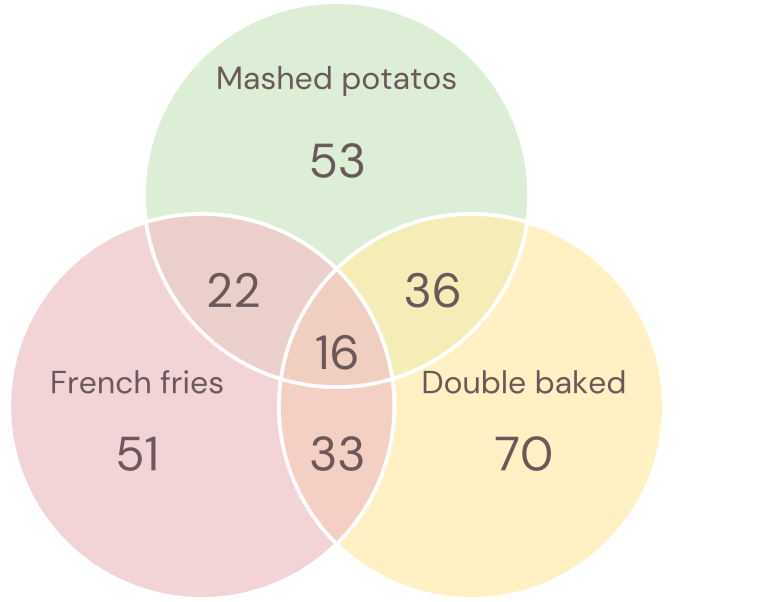
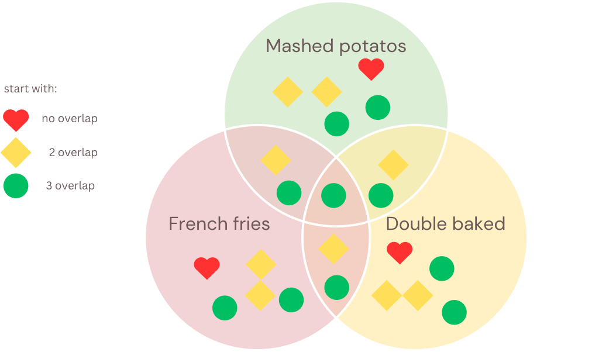

# question 4 unit 3.3 

## by: Udval and Alex

In a recent survey, 115 students reported whether they liked their potatoes mashed, French-fried, or twice-baked. 53 liked them mashed, 51 liked French fries, and 70 liked twice baked potatoes. Additionally, 22 students liked both mashed and French-fried potatoes, 33 liked French fries and twice baked potatoes, 36 liked mashed and baked, and 16 liked all three styles. How many students hate potatoes? Explain why your answer is correct.

This diagram visually represents the relationships between mashed, french, and baked potato preferences.

 
It can also be represented like this:  

$mashed = 53$  
$french = 51$  
$baked = 70$  
$mashed \cap french = 22$  
$baked \cap mashed = 36$  
$french \cap baked = 33$
$french \cap baked \cap mashed = 16$

Then we can solve for the amount of people who like potatoes with this formula 
$(mashed + french + baked) - (mashed \cap french + baked \cap mashed + french \cap baked) + french \cap baked \cap mashed$
$(53+51+70)-(22+36+33)+16$
$(174)-(91)+16$
$99$ people liked some form of potatoes
$115$ people took the survey do $115-99$ people did not vote

16 people hate potatoes

 

#### taking a closer look at why this formula works:

 we can see that if you add up the outer circles you get 174

this number over counts though:
unions of 2 areas count double as much as they should so we need to subtract them out to get them to only contribute once.

then we need to look at the union of all three:
this contributes to all other regions but since we already subtracted the other regions we have subtracted it 3 times already.
since we have already subtracted it too much we need to add it back.

<!-- 

In this diagram I started each area with its own shape according to how many overlapping circles their were.

Then these shapes cascade into the main other areas like the numbers do in the original venn diagram.

When you add all of the non-overlapped squares it becomes obvious why some get sub in the formula.

there is now  -->